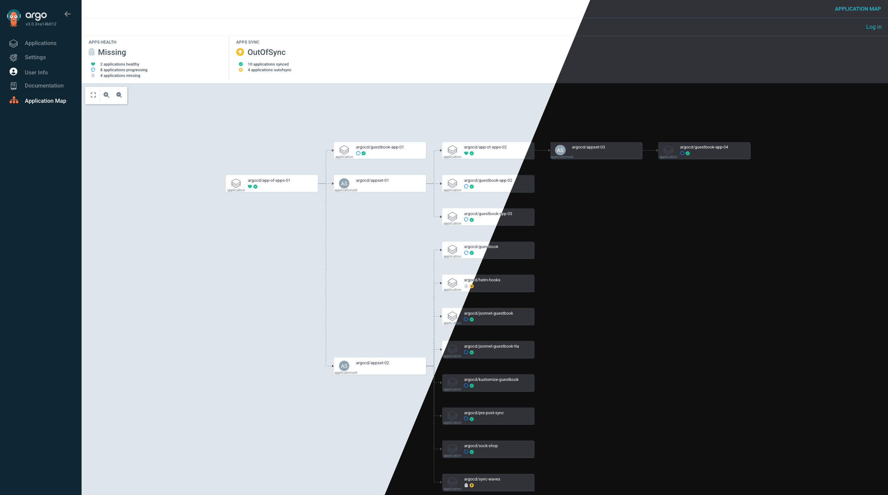

<!-- trunk-ignore-all(markdownlint/MD033) -->

# ArgoCD Application Map Extension

<div align="center">

[](https://opensource.org/licenses/Apache-2.0)
[](https://argoproj.github.io/argo-cd/)
[](https://github.com/chezmoi-sh/argocd-extension-application-map/releases)
[](https://github.com/chezmoi-sh/argocd-extension-application-map/pulls)

</div>

## Overview

ArgoCD Application Map is an ArgoCD extension that provides an interactive visualization of your ArgoCD applications and their dependencies. It enhances the ArgoCD UI by adding a dynamic application map that helps you understand the relationships and status of your applications at a glance.

<div align="center">
  
  <br/>
  <em>Interactive application map showing dependencies between ArgoCD applications</em>
</div>

## Installation

### Prerequisites

- ArgoCD v2.7.0 or later

> [!WARNING]
> There is a regression in ArgoCD 3.x that breaks this extension.
>
> See [this issue](https://github.com/argoproj/argo-cd/issues/22921) for more details.

### Install UI Extension

The UI extension needs to be installed by mounting the React component in Argo CD API server. This process can be automated by using the argocd-extension-installer. This installation method will run an init container that will download, extract and place the file in the correct location.

#### Helm

To install the UI extension with the [Argo CD Helm chart](https://artifacthub.io/packages/helm/argo/argo-cd) add the following to the values file:

```yaml
server:
  extensions:
    enabled: true
    extensionList:
      - name: extension-trivy
        env:
          - name: EXTENSION_URL
            value: https://github.com/chezmoi-sh/argocd-extension-application-map/releases/download/v0.1.0/extension-application-map.tar
          - name: EXTENSION_CHECKSUM_URL
            value: https://github.com/chezmoi-sh/argocd-extension-application-map/releases/download/v0.1.0/extension-application-map_checksums.txt
```

#### Kustomize

Alternatively, the yaml file below can be used as an example of how to define a kustomize patch to install this UI extension:

```yaml
apiVersion: apps/v1
kind: Deployment
metadata:
  name: argocd-server
spec:
  template:
    spec:
      initContainers:
        - name: extension-application-map
          image: quay.io/argoprojlabs/argocd-extension-installer:v0.0.1
          env:
            - name: EXTENSION_URL
              value: https://github.com/chezmoi-sh/argocd-extension-application-map/releases/download/v0.1.0/extension-application-map.tar
            - name: EXTENSION_CHECKSUM_URL
              value: https://github.com/chezmoi-sh/argocd-extension-application-map/releases/download/v0.1.0/extension-application-map_checksums.txt
          volumeMounts:
            - name: extensions
              mountPath: /tmp/extensions/
          securityContext:
            runAsUser: 1000
            allowPrivilegeEscalation: false
      containers:
        - name: argocd-server
          volumeMounts:
            - name: extensions
              mountPath: /tmp/extensions/
      volumes:
        - name: extensions
          emptyDir: {}
```

## Roadmap

### v1.0 - Core Enhancements

- [ ] UI/UX Improvements
  - [ ] Add support for dark mode
  - [ ] Add support for dynamic refresh of map

### v1.1 - Search and Filter

- [ ] Advanced Filtering
  - [ ] Add support for filtering applications _(side panel like in the ArgoCD UI)_
  - [ ] Add support for searching applications _(search bar in the top bar)_
  - [ ] Add filter by application status
  - [ ] Add filter by namespace
- [ ] Search Enhancements
  - [ ] Add fuzzy search support
  - [ ] Add search suggestions

### Future Considerations

- [ ] Application clustering using ArgoCD projects, clusters or labels

## Contributing

We welcome contributions! Please see our [Contributing Guide](CONTRIBUTING.md) for details.

## License

This project is licensed under the Apache License 2.0 - see the [LICENSE](LICENSE) file for details.

## Acknowledgments

- [ArgoCD](https://argoproj.github.io/argo-cd/) for the amazing GitOps platform
- [@dagrejs/dagre](https://github.com/dagrejs/dagre) for the graph layout engine
- [@xyflow/react](https://github.com/xyflow/xyflow) for the interactive graph visualization

## Support

If you encounter any issues or have questions, please [open an issue](https://github.com/chezmoi-sh/argocd-extension-application-map/issues) on GitHub.
