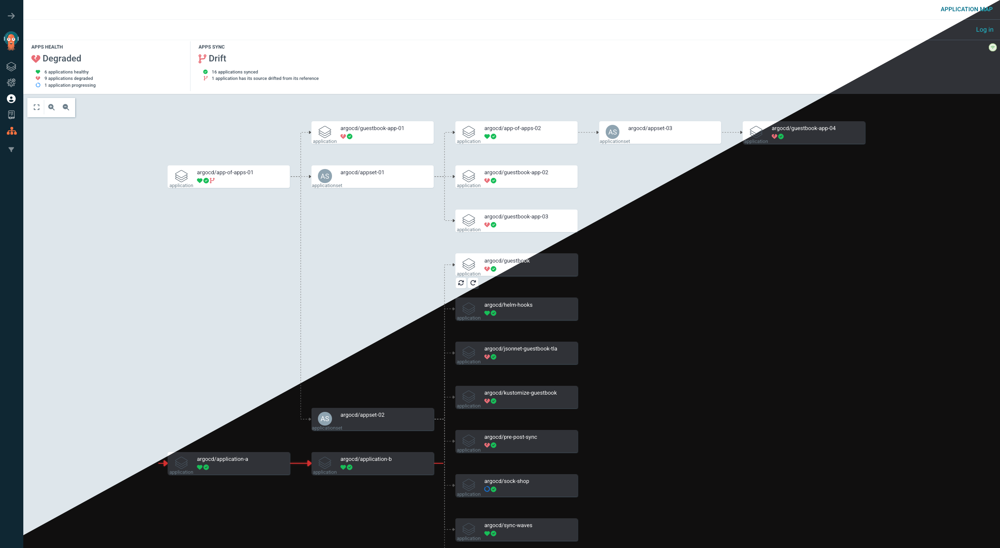

<!-- trunk-ignore-all(markdownlint/MD033) -->

# ArgoCD Application Map Extension

<div align="center">

[](https://opensource.org/licenses/Apache-2.0)
[](https://argoproj.github.io/argo-cd/)
[](https://github.com/chezmoi-sh/argocd-extension-application-map/releases)
[](https://github.com/chezmoi-sh/argocd-extension-application-map/pulls)

</div>

## Overview

ArgoCD Application Map is an ArgoCD extension that provides an interactive visualization of your ArgoCD applications and their dependencies. It enhances the ArgoCD UI by adding a dynamic application map that helps you understand the relationships and status of your applications at a glance.

<div align="center">
  
  <br/>
  <em>Interactive application map showing dependencies between ArgoCD applications</em>
</div>

## Installation

### Prerequisites

- ArgoCD v2.x or later

### Install UI Extension

The UI extension needs to be installed by mounting the React component in Argo CD API server. This process can be automated by using the argocd-extension-installer. This installation method will run an init container that will download, extract and place the file in the correct location.

#### Helm

To install the UI extension with the [Argo CD Helm chart](https://artifacthub.io/packages/helm/argo/argo-cd) add the following to the values file:

```yaml
server:
  extensions:
    enabled: true
    extensionList:
      - name: extension-application-map
        env:
          - name: EXTENSION_URL
            value: https://github.com/chezmoi-sh/argocd-extension-application-map/releases/download/latest/extension-application-map.tar
          - name: EXTENSION_CHECKSUM_URL
            value: https://github.com/chezmoi-sh/argocd-extension-application-map/releases/download/latest/extension-application-map_checksums.txt
```

#### Kustomize

Alternatively, the yaml file below can be used as an example of how to define a kustomize patch to install this UI extension:

```yaml
apiVersion: apps/v1
kind: Deployment
metadata:
  name: argocd-server
spec:
  template:
    spec:
      initContainers:
        - name: extension-application-map
          image: quay.io/argoprojlabs/argocd-extension-installer:v0.0.1
          env:
            - name: EXTENSION_URL
              value: https://github.com/chezmoi-sh/argocd-extension-application-map/releases/download/latest/extension-application-map.tar
            - name: EXTENSION_CHECKSUM_URL
              value: https://github.com/chezmoi-sh/argocd-extension-application-map/releases/download/latest/extension-application-map_checksums.txt
          volumeMounts:
            - name: extensions
              mountPath: /tmp/extensions/
          securityContext:
            runAsUser: 1000
            allowPrivilegeEscalation: false
      containers:
        - name: argocd-server
          volumeMounts:
            - name: extensions
              mountPath: /tmp/extensions/
      volumes:
        - name: extensions
          emptyDir: {}
```

## Features

### Quick Actions

The extension provides a Quick Actions system that allows you to perform common tasks directly from the application map. This includes actions like refreshing the application state, syncing applications, and reverting drifted applications when necessary.

To access Quick Actions, simply hover over the application node in the map. A context menu will appear, allowing you to select the desired action.


> [!NOTE]
> If you don't have the necessary permissions to perform an action, it will be disabled in the Quick Actions menu.

3 buttons are available in the Quick Actions menu:

- **Refresh**: This button allows you to refresh the application state, ensuring that the map reflects the latest status of your applications.
- **Sync**: This button initiates a synchronization of the application with its source, applying any changes that have been made in the Git repository.
- **Revert Drift**: This button reverts the application source configuration to its expected state defined in the `Application` annotations.

### Source Drift Detection

This extension includes a source drift detection feature that allows you to monitor and manage deviations from your application's expected source configuration. It provides visual indicators for applications that have drifted from their defined source references, enabling quick identification and remediation.

#### Application Annotations

Add the following annotations to your ArgoCD Application manifests:

| Annotation                                      | Description                                           |
| ----------------------------------------------- | ----------------------------------------------------- |
| `source-ref.argocd.argoproj.io/repo`            | Git repository URL that serves as the source of truth |
| `source-ref.argocd.argoproj.io/target-revision` | Expected branch, tag, or commit SHA                   |
| `source-ref.argocd.argoproj.io/path`            | Path within the repository (default: repository root) |
| `source-ref.argocd.argoproj.io/chart`           | Helm chart name (for Helm-based applications)         |

```yaml
apiVersion: argoproj.io/v1alpha1
kind: Application
metadata:
  name: my-application
  annotations:
    # Git repository reference
    source-ref.argocd.argoproj.io/repo: 'https://github.com/my-org/my-repo'

    # Target revision (branch, tag, or commit SHA)
    source-ref.argocd.argoproj.io/target-revision: 'main'

    # Specific path within the repository
    source-ref.argocd.argoproj.io/path: 'manifests/production'

    # Helm chart information (if using Helm)
    source-ref.argocd.argoproj.io/chart: 'my-chart'
spec:
  # ... rest of your application spec
```

It also possible to specify multiple sources for an application. This is useful when your application consists of multiple components that are managed in different repositories or paths.

```yaml
apiVersion: argoproj.io/v1alpha1
kind: Application
metadata:
  name: my-multi-source-application
  annotations:
    # Configuration of the first source
    source-ref.argocd.argoproj.io/0.repository-url: 'https://github.com/org/app'
    source-ref.argocd.argoproj.io/0.path: 'manifests'

    # Configuration of the second source
    source-ref.argocd.argoproj.io/1.repository-url: 'https://github.com/org/config'
    source-ref.argocd.argoproj.io/1.target-revision: 'main'

    # ...
spec:
  # ... rest of your application spec
```

### Cycle Detection

The extension automatically detects cycles in your application dependencies. If a cycle is detected, it will be highlighted in the map, allowing you to quickly identify and resolve circular dependencies.


## Roadmap

### v1.0 - MVP (2025-05-25)

- [x] Main features
  - [x] Interactive, zoomable map of ArgoCD Applications and ApplicationSets
  - [x] Visualizes dependencies and detects cycles
  - [x] Filter by health and sync status
  - [x] Status summary panel
  - [x] Click on a node to open the native ArgoCD application page
  - [x] Fully integrated with ArgoCD UI (supports dark mode)

### v1.1 - Dynamic Refresh (2025-08)

- [x] **Real-time Updates via SSE (Server-Sent Events)**
  - [x] Dynamic refresh of map when ArgoCD applications are updated
  - [x] Live synchronization of application states and statuses
  - [x] Seamless real-time drift detection notifications

- [x] **Quick Actions Enhancements**
  - [x] Extended Quick Actions system with "Refresh" or "Sync" buttons directly on application nodes
  - [x] One-click source resync functionality for drifted applications

- [x] **Source Drift Detection & Management**
  - [x] Visual drift indicators using branch icons
  - [x] Automatic detection via Kubernetes annotations (`source-ref.argocd.argoproj.io/*`)
  - [x] One-click revert functionality for drifted applications
  - [x] Integration with Quick Actions system

## Contributing

We welcome contributions! Please see our [Contributing Guide](CONTRIBUTING.md) for details.

## License

This project is licensed under the Apache License 2.0 - see the [LICENSE](LICENSE) file for details.

## Acknowledgments

- [ArgoCD](https://argoproj.github.io/argo-cd/) for the amazing GitOps platform
- [@dagrejs/dagre](https://github.com/dagrejs/dagre) for the graph layout engine
- [@xyflow/react](https://github.com/xyflow/xyflow) for the interactive graph visualization

## Support

If you encounter any issues or have questions, please [open an issue](https://github.com/chezmoi-sh/argocd-extension-application-map/issues) on GitHub.
