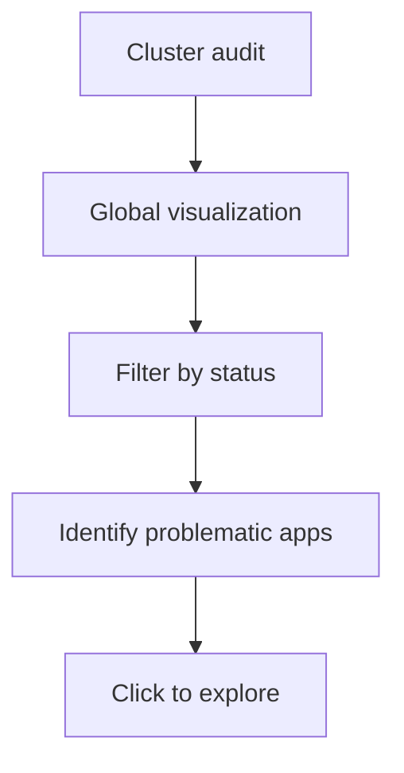

# Product Requirements Document (PRD)

- **Document Title**: ArgoCD Application Map Extension
- **Version**: 1.0 (MVP)
- **Last Updated**: 2025-05-25

---

## Executive Summary

- **Objective**: Provide an ArgoCD UI extension for hierarchical, interactive, and global visualization of Applications and ApplicationSets, to facilitate audit, debugging, and understanding of complex deployments.
- **Scope**: Frontend extension (React/TypeScript) integrated into ArgoCD, no dedicated backend, fully aligned with native style and RBAC permissions.

---

## Background and Context

- **Business Need**: OPS and DEV teams lack a global and interactive view of ArgoCD applications, making audit, debugging, and incident management complex.
- **Strategic Category**: Observability improvement, MTTR reduction, multi-cluster support.
- **Problem Statement**: Native ArgoCD tools do not allow simple visualization of dependencies, statuses, and complex deployment chains.
- **Current State**: Limited visualization, manual navigation, no interactive map, audit and debugging difficulties.

---

## Personas

- **OPS (SRE, Production)**: Visualize global state, quickly identify errors, understand dependency chains, respond to alerts.
- **DEV (Team Developer)**: Easily find their application, explore dependencies, understand root causes of malfunctions.
- **LEAD TECH / MANAGER**: Macro view of deployment status, identify weak points, prepare audits.

---

## User Journeys

### OPS – Alert Management

```mermaid
graph TD
    A[Alert received] --> B[Open the map]
    B --> C[View apps in error (red status)]
    C --> D[Click on status panel → filter apps in error]
    D --> E[Select the problematic app]
    E --> F[Focus on the map]
    F --> G[Click → native ArgoCD page]
    G --> H[Investigation]
```

### DEV – Application Debugging

```mermaid
graph TD
    A[App KO] --> B[Open the map]
    B --> C[Visual search or via status panel]
    C --> D[Filter on "degraded"]
    D --> E[Filter on "unsync"]
    E --> F[Find the problematic app]
    F --> G[Click → app details]
```

### OPS – Cluster Audit



---

## User Experience (UX) – Main Interactions

- Drag & drop on the map: navigation
- Zoom +/- buttons: zoom in/out
- Fit-to-screen button: recenter and adjust zoom
- Click on an application: redirect to the native ArgoCD page
- Dynamic search (name, cluster, namespace, labels)
- Status selection in the panel: filter by status (health, sync)
- ArgoCD theme change: dark/light mode support
- Click on the map: reset filters/selections

> **Note**: Filtering highlights relevant applications without hiding others.

---

## Requirements

### Graphical Visualization

- Interactive map of Applications and ApplicationSets (directed graph)
- Smooth navigation: zoom, fit-to-screen, drag & drop
- Display of dependencies, support for nested chains (AppSet/App)
- Cycle detection and reporting

### Filtering and Search

- Filtering by status (Health, Sync)
- Side panel summarizing statuses
- Text search (planned v1.2): name, cluster, namespace, labels

### Navigation and ArgoCD Integration

- Direct navigation: click on a node → native ArgoCD page
- Native style compliance, dark mode support
- Responsive desktop experience

### Security and Access

- No custom authentication: exclusive use of ArgoCD API (RBAC)
- Display conditioned by API permissions

### Testing and Quality

- Enhanced unit tests on critical hooks and components
- Storybook for interactive UI documentation
- CI/CD: lint, build, tests, packaging

---

## Acceptance Criteria & User Stories

- **Acceptance Criteria**:

  - Interactive and smooth visualization of all applications and dependencies
  - Real-time filtering by status (health, sync)
  - Direct navigation to the native ArgoCD page
  - Native style and dark mode compliance
  - Unit tests and Storybook documentation in place
  - CI/CD packaging ready for deployment via Extension Installer

- **User Story 1**:  
  _As an OPS, I want to filter applications in error to quickly investigate an alert._

- **User Story 2**:  
  _As a DEV, I want to explore my application's dependencies to understand a malfunction._

- **User Story 3**:  
  _As a LEAD TECH, I want a macro view of deployment status to prepare an audit._

---

## Dependencies

- ArgoCD API (`/api/v1/applications`, `/resource-tree`)
- ArgoCD RBAC
- Libraries: @xyflow/react (ReactFlow), @dagrejs/dagre, Material-UI, React, TypeScript
- Dev tools: Tilt, Storybook, Jest

---

## Design

- **Architecture**: Frontend extension (React/TypeScript), integrated via ArgoCD Extension API, no dedicated backend.
- **Data Model**: Applications/ApplicationSets hierarchy, dependencies, statuses, organization by project/cluster.
- **UI**:
  - Interactive map (ReactFlow), smooth navigation, native statuses, side filters, responsive desktop.
  - Visual groups by cluster/project, dotted containers, header with name and count.
  - Sidebar filters (project, cluster, health, sync, labels), persistent state.
- **API Integration**:
  - Direct data access via props, real-time sync, error handling, native RBAC.
- **Performance**:
  - Lazy loading, pagination, virtual scroll, caching, debounced updates, memoization.
- **Security**:
  - Strict RBAC compliance, permission-based filtering, secure communication.

---

## Roadmap & Timeline

### Roadmap

#### v1.0 - MVP

- Interactive, zoomable map of ArgoCD Applications and ApplicationSets
- Visualizes dependencies and detects cycles
- Filter by health and sync status
- Status summary panel
- Click on a node to open the native ArgoCD application page
- Fully integrated with ArgoCD UI (supports dark mode)

#### v1.1 - Search and Filter

- Advanced Filtering
  - Add support for filtering applications (side panel like in the ArgoCD UI)
  - Add support for searching applications (search bar in the top bar)
  - Add filter by application status
  - Add filter by namespace
- Search Enhancements
  - Add fuzzy search support
  - Add search suggestions

#### v1.2 - Dynamic Refresh

- Add support for dynamic refresh of map when ArgoCD applications are updated using SSE (Server-Sent Events)

| Milestone | Goal                                                    |
| --------- | ------------------------------------------------------- |
| v1.0      | MVP feature are implemented and tested                  |
| v1.1      | Ad-hoc search and filter are implemented and tested     |
| v1.2      | The page is refreshed when the applications are updated |

---

## Risks and Mitigation

- **Strong dependency on the ArgoCD API**: continuous monitoring, rapid adaptation
- **No dedicated backend**: RBAC/quotas limitations → frontend error handling
- **Scalability >1000 apps not a priority**: MVP focus, regular benchmarks
- **No mobile support**: desktop focus
- **Performance**: continuous monitoring and optimization

---

## Glossary

- **Application**: ArgoCD resource representing a Kubernetes deployment managed by GitOps.
- **ApplicationSet**: ArgoCD resource dynamically generating multiple Applications.
- **Health Status**: Application health status (Healthy, Degraded, etc.).
- **Sync Status**: Synchronization status between desired state (Git) and current state (cluster).
- **SSE**: Server-Sent Events for real-time updates.
- **RBAC**: Role-based access control, natively managed by ArgoCD.

---

## Annexes & References

- [ArgoCD Documentation](https://argo-cd.readthedocs.io/en/stable/)
- [ArgoCD UI Extensions](https://argo-cd.readthedocs.io/en/stable/developer-guide/extensions/ui-extensions/)
- [ReactFlow](https://reactflow.dev/docs/)
- [DagreJS](https://github.com/dagrejs/dagre)
- [Storybook](https://storybook.js.org/docs/react/get-started/introduction)
- [Jest](https://jestjs.io/docs/getting-started)
- [Kind](https://kind.sigs.k8s.io/docs/user/quick-start/)
- [Tilt](https://docs.tilt.dev/install.html)
