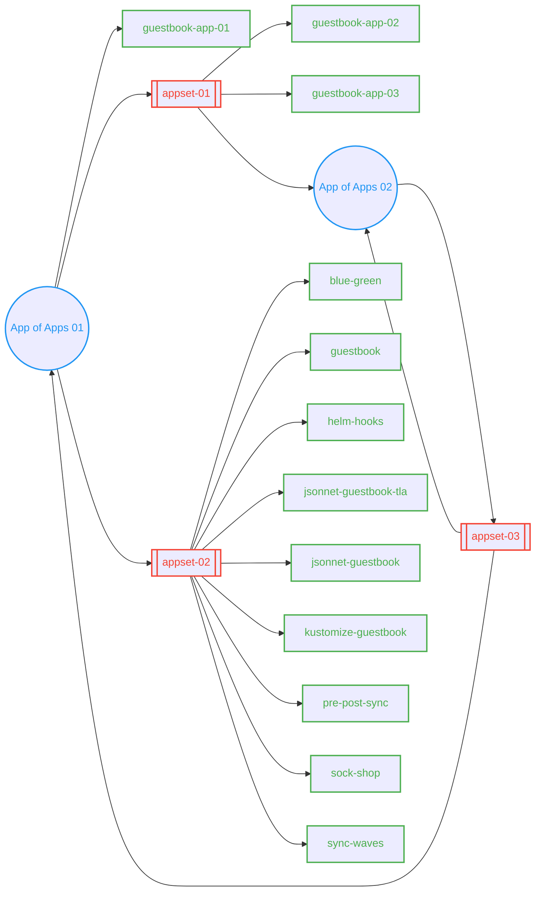

# ArgoCD Application Examples

This repository contains practical examples of different application linking patterns in ArgoCD.

## Table of Contents
- [Application Types](#application-types)
- [Relationship Diagram](#relationship-diagram)

## Application Types

The repository demonstrates three main types of applications:

- **Applications**: Individual deployments (e.g., guestbook, blue-green)
- **App of Apps**: Parent applications that manage other applications
- **ApplicationSets**: Dynamically generated collections of applications

> **Note**: ApplicationSets are essentially dynamic App of Apps. While App of Apps requires manual definition of child applications, ApplicationSets can automatically generate applications based on templates and generators.

## Relationship Diagram

The diagram below illustrates the relationships between different applications and their dependencies:

The arrows indicate dependency relationships between applications, showing how deployments are orchestrated and how applications are linked together.

> **Note**: These complex dependency patterns are included for testing purposes of the ArgoCD Application Map Extension. While they demonstrate various application linking scenarios, some patterns like the circular dependency of App of Apps 02 should be avoided in production environments. Having multiple parents (App of Apps 01 and AppSet 04) for App of Apps 02 creates a permanent diff state and is considered an anti-pattern in ArgoCD deployments.

### Graph Explanation

The graph above illustrates the relationships between different ArgoCD applications. Here's a detailed explanation:

- `App of Apps 01` deploys:
  - `guestbook-app-01`
  - `appset-01` and `appset-02` (ApplicationSets)

- `appset-01` deploys:
  - `guestbook-app-02` and `guestbook-app-03`
  - `App of Apps 02`

- `appset-02` deploys:
  - `blue-green` (blue-green deployment)
  - `guestbook` (standard guestbook)
  - `helm-hooks` (Helm hooks demo)
  - `jsonnet-guestbook-tla` and `jsonnet-guestbook` (Jsonnet apps)
  - `kustomize-guestbook` (Kustomize app)
  - `pre-post-sync` (sync hooks demo)
  - `sock-shop` (demo app)
  - `sync-waves` (sync waves demo)

- `App of Apps 02` deploys:
  - `appset-03`

- `appset-03` deploys:
  - `App of Apps 01` and `App of Apps 02` (creating a circular dependency)
